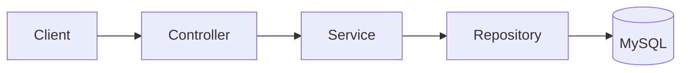
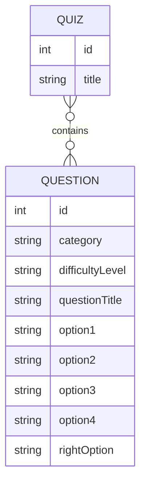

# Quizora

> A Spring Boot quiz platform built from the ground up to explore REST APIs, JPA, MySQL, and backend architecture.


Quizora is a monolithic REST backend for building and taking quizzes. Questions are stored by category and difficulty, quizzes are assembled from random questions in a chosen category, and submitted answers are scored on the server, without the correct answers ever being exposed to the player while the quiz is being taken.

It is a work in progress. The project is built to understand how a backend fits together by actually building one, and the roadmap below shows where it goes next.

---

## Why I Built This

Tutorials make it easy to end up with code that works without knowing why. I built Quizora to close that gap: to follow a single request all the way through a real backend and understand each hop.

```
HTTP request → Controller → Service → Repository → Database
```

A quiz app is a good vehicle for this. It is small enough to hold in my head, but rich enough to need real design decisions: how to model a many-to-many relationship, how to avoid leaking the correct answer to the client, how to pick random rows from a database, and what a sensible REST surface looks like.

Every limitation listed later in this README is something I know about and plan to address. I would rather document where the project honestly stands than pretend it is finished.

---

## What It Does

- **Question management.** Add, list, filter by category, and delete questions. Each question has a category, a difficulty level, four options, a title, and a correct answer.
- **Quiz generation.** Request a quiz by category, number of questions, and title. Quizora pulls random questions from that category and persists the quiz.
- **Answer hiding.** When a quiz is fetched, the client receives `QuestionWrapper` objects that deliberately omit the correct answer.
- **Submission and scoring.** The client submits a list of answers, the service compares them with the stored correct answers, and a score is returned.

---

## Architecture

Quizora is a layered monolith. Each layer has one job and only talks to the layer directly below it.



- **Controllers** (`QuestionController`, `QuizController`) handle HTTP: mapping routes, reading path variables, query parameters and request bodies, and returning responses. They contain no business logic.
- **Services** (`QuestionService`, `QuizService`) hold the application logic: assembling a quiz, building wrappers that hide answers, and calculating scores.
- **Repositories** (`QuestionRepository`, `QuizRepository`) are Spring Data JPA interfaces that abstract all database access.
- **Models** are the JPA entities plus the objects that travel over the wire (`QuestionWrapper`, `Response`).

Keeping these separate meant that when I changed how a quiz is built, only the service had to change, and the HTTP contract stayed the same.

---

## Core Engineering Concepts

### Layered Architecture
Controllers delegate, services decide, repositories persist. Dependencies are injected by Spring rather than constructed by hand, which keeps each layer easy to reason about in isolation.

### JPA Entity Relationships
`Quiz` and `Question` are linked by a Many-to-Many relationship. A question can appear in many quizzes, and a quiz contains many questions. Hibernate generates the join table, so the relationship is expressed on the Java side as a collection of `Question` objects on `Quiz`.

### DTO / `QuestionWrapper`
The `Question` entity contains the correct answer (`rightOption`). Returning it directly would hand the answer key to the client. `QuestionWrapper` exposes only what a player should see (the question and its options), so the entity can stay complete while the API stays safe.

### Enum Persistence
`Category` and `DifficultyLevel` are Java enums stored with `EnumType.STRING`. Storing the name instead of the ordinal means that reordering or inserting enum constants later does not silently corrupt existing rows.

### Native Query for Random Questions
Random selection is done in the database with a native MySQL query using `ORDER BY RAND()`, filtered by category and limited to the requested count. It is simple and effective at this scale, though it ties that query to MySQL (see [Known Limitations](#known-limitations)).

### REST Request Handling
The API uses all three common input styles: **path variables** (`/quiz/get/{id}`), **query parameters** (`/quiz/create?category=...&numQ=...&title=...`), and **JSON request bodies** (adding questions, submitting answers). Jackson handles serialization and deserialization between JSON and Java objects.

---

## Project Structure

```
com.practice.quizora
├── controllers
│   ├── QuestionController
│   └── QuizController
├── services
│   ├── QuestionService
│   └── QuizService
├── repositories
│   ├── QuestionRepository
│   └── QuizRepository
├── models
│   ├── Question          # JPA entity
│   ├── Quiz              # JPA entity
│   ├── QuestionWrapper   # what the player sees (no correct answer)
│   └── Response          # what the player submits (question id + answer)
└── enums
    ├── Category
    └── DifficultyLevel
```

---

## API Overview

| Method | Endpoint | Purpose |
|--------|----------|---------|
| `GET` | `/question/getQuestions` | List all questions |
| `GET` | `/question/category/{category}` | List questions in a category |
| `POST` | `/question/add` | Add a question (JSON body) |
| `DELETE` | `/question/del/{id}` | Delete a question by id |
| `DELETE` | `/question/del?questionTitle=...` | Delete a question by title |
| `POST` | `/quiz/create?category=&numQ=&title=` | Generate a quiz from random questions |
| `GET` | `/quiz/get/{id}` | Get a quiz's questions (answers hidden) |
| `POST` | `/quiz/submit/{id}` | Submit answers and receive a score |
| `GET` | `/quiz/delete/{id}` | Delete a quiz (see limitations) |

**Adding a question**

```json
{
  "category": "Java",
  "difficultyLevel": "EASY",
  "questionTitle": "Which keyword is used to inherit a class in Java?",
  "option1": "extends",
  "option2": "implements",
  "option3": "inherits",
  "option4": "super",
  "rightOption": "extends"
}
```

`category` and `difficultyLevel` must match values defined in the `Category` and `DifficultyLevel` enums.

**Submitting answers**

```json
[
  { "id": 1, "answer": "Option A" },
  { "id": 3, "answer": "Option C" }
]
```

---

## Database Design

Two entities, one relationship.



Because the relationship is Many-to-Many, Hibernate creates a join table between the two. A question is a reusable building block, and a quiz is just a particular selection of them.

---

## Example Flow

Here is a complete quiz lifecycle, and what happens inside the application at each step.

**1. Create a quiz**

```
Client
  → POST /quiz/create?category=Java&numQ=5&title=MyQuiz
  → QuizController
  → QuizService
  → QuestionRepository → MySQL     (5 random questions via ORDER BY RAND())
  → QuizRepository     → MySQL     (save quiz and its join-table rows)
```

**2. Take the quiz**

```
Client
  → GET /quiz/get/{id}
  → QuizController → QuizService → QuizRepository → MySQL
  ← List<QuestionWrapper>          (correct answers stripped out)
```

**3. Submit answers**

```
Client
  → POST /quiz/submit/{id}  (List<Response>)
  → QuizController
  → QuizService              (compares answers with stored rightOption values)
  ← score
```

---

## Current Development Status

**Implemented**

- [x] Question CRUD
- [x] Category and difficulty enums
- [x] Random quiz creation
- [x] Quiz retrieval with hidden correct answers
- [x] Quiz submission and basic scoring
- [x] Quiz deletion
- [x] MySQL persistence through JPA/Hibernate
- [x] Layered Spring Boot architecture

**Next**

- [ ] Scoring that matches responses by question id
- [ ] Bean validation and global exception handling
- [ ] Proper HTTP semantics (`DELETE` for quiz deletion, better status codes)
- [ ] A real automated test suite

---

## Known Limitations

This is where the project honestly stands today.

- **Scoring depends on list order.** Responses are compared to questions by position rather than by question id, so the submitted order matters.
- **Basic exception handling.** There is no global handler yet, and error responses are minimal.
- **Limited validation.** Request input is not thoroughly validated.
- **`GET` is used for quiz deletion.** It works, but a state-changing operation belongs on `DELETE`.
- **Some HTTP status codes** could be more precise.
- **Minimal tests.** The only test currently is the default Spring context-load test.
- **MySQL-specific random query.** `ORDER BY RAND()` ties quiz generation to MySQL.

---

## Roadmap

Everything below is **planned, not implemented**.

- Fix scoring to match answers by question id
- Bean validation and a global exception handler (`@ControllerAdvice`)
- Unit and integration tests
- Correct REST semantics and status codes
- Spring Security with authentication
- Admin and Player roles
- Swagger / OpenAPI documentation
- Pagination for question listings
- Docker support
- CI/CD pipeline

---

## Running Locally

**Prerequisites:** Java 21, Maven, MySQL 8+

**1. Clone the repository**

```bash
git clone <repository-url>
cd quizora
```

**2. Create the database**

```sql
CREATE DATABASE quizora;
```

**3. Configure the application**

In `src/main/resources/application.properties`, set your own connection details:

```properties
spring.datasource.url=jdbc:mysql://localhost:3306/quizora
spring.datasource.username=<your-mysql-username>
spring.datasource.password=<your-mysql-password>
```

Keep real credentials out of version control. Environment variables or a local, git-ignored properties file work well.

**4. Run**

```bash
mvn spring-boot:run
```

The API is served on `http://localhost:8080` by default.

---

## API Testing

Create a quiz:

```bash
curl -X POST "http://localhost:8080/quiz/create?category=Java&numQ=5&title=MyQuiz"
```

Fetch it (replace `1` with the returned quiz id):

```bash
curl http://localhost:8080/quiz/get/1
```

Submit answers:

```bash
curl -X POST http://localhost:8080/quiz/submit/1 \
  -H "Content-Type: application/json" \
  -d '[{"id": 1, "answer": "Option A"}, {"id": 3, "answer": "Option C"}]'
```

The same requests work in Postman.

---

## What I Learned

- **How a request moves through Spring MVC.** Following one HTTP call from the controller, through the service, to the database and back made the framework far less magical.
- **Why controllers should stay thin.** Keeping logic in services made each layer easier to change without breaking the others.
- **What repositories actually abstract.** Spring Data JPA removes boilerplate, but I still had to understand the SQL it generates, especially where I dropped to a native query.
- **How JPA maps objects to tables.** Entities, enums, and especially the Many-to-Many join table became concrete once I looked at what Hibernate created.
- **Why DTOs matter.** `QuestionWrapper` exists because the shape of the data you store is not always the shape you should expose.
- **Why HTTP semantics matter.** Using `GET` for deletion works, but it breaks the contract clients and tools expect from the verb.
- **Why validation and exception handling become essential.** The gaps in this project show exactly where things go wrong once real users send unexpected input.
- **Why a design shortcut costs later.** Relying on list order for scoring was easy to write, and it is a limitation I now understand well enough to fix properly.

---

## Future Direction

Quizora started as a way to understand the backend request pipeline. The next stage is making it behave like a more complete application: correct scoring, validated input, consistent error handling, real tests, and eventually security and deployment tooling. The project will keep evolving, and this README will be updated as it does.